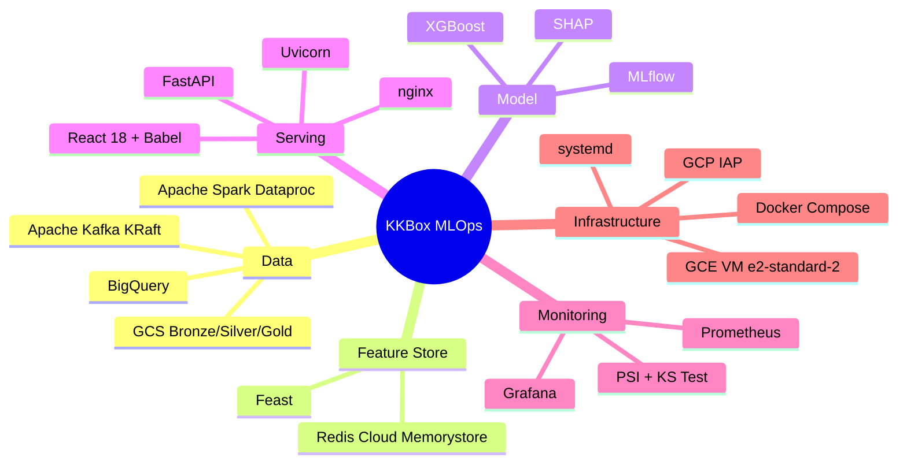
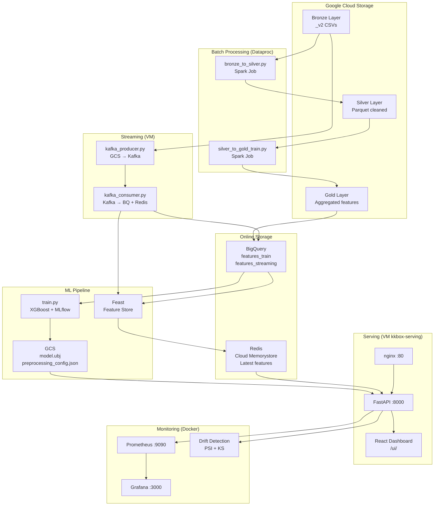

# KKBox Churn Prediction

> End-to-end MLOps pipeline dự đoán churn người dùng KKBox music streaming — từ raw data đến real-time serving, giám sát và drift detection trên GCP.

---

## Mục lục

- [Giới thiệu bài toán](#giới-thiệu-bài-toán)
- [Tech Stack](#tech-stack)
- [Đề xuất mô hình](#đề-xuất-mô-hình)
- [Kiến trúc hệ thống](#kiến-trúc-hệ-thống)
- [Repository Structure](#repository-structure)
- [Các Pipeline chính](#các-pipeline-chính)
- [Kết quả](#kết-quả)
- [Kết luận](#kết-luận)
- [Thành viên nhóm](#thành-viên-nhóm)

---

## Giới thiệu bài toán

**Churn** (rời bỏ dịch vụ) là một trong những vấn đề kinh doanh cốt lõi của các nền tảng subscription. KKBox — nền tảng âm nhạc streaming lớn tại Đài Loan và Đông Nam Á — phải đối mặt với bài toán: **dự đoán user nào sẽ không gia hạn gói trong tháng tới**, từ đó có chiến lược giữ chân kịp thời.

### Định nghĩa

Cho một tập user $U$ với lịch sử hành vi đến thời điểm $t$, mục tiêu là học một hàm:

$$f: \mathbf{x}_i \rightarrow y_i \in \{0, 1\}$$

Trong đó:
- $\mathbf{x}_i \in \mathbb{R}^{18}$ là vector feature của user $i$ (hành vi nghe nhạc, lịch sử subscription, thông tin nhân khẩu)
- $y_i = 1$ nếu user churn (không gia hạn), $y_i = 0$ nếu tiếp tục dùng

### Đặc điểm dữ liệu

| Đặc điểm | Chi tiết |
|---------|---------|
| Số users | ~1.08M |
| Churn rate | ~10% (imbalanced) |
| Thời gian | Lịch sử đến 2016-12-31, streaming 2017 |
| Features | 18 features từ 3 nguồn: subscription, listening behavior, demographics |

### Thách thức

- **Class imbalance**: chỉ ~10% user churn → mô hình dễ thiên về predict non-churn
- **Cold start**: user mới chưa có lịch sử → cần imputation
- **Feature drift**: hành vi user thay đổi theo thời gian → cần monitoring
- **Real-time serving**: features phải được cập nhật liên tục từ streaming data

---

## Tech Stack



| Layer | Technology |
|-------|-----------|
| Data Storage | Google Cloud Storage, BigQuery |
| Stream Processing | Apache Kafka 7.5 (KRaft mode), Python |
| Batch Processing | Apache Spark 3.x trên GCP Dataproc |
| Feature Store | Feast, Redis (Cloud Memorystore) |
| Model Training | XGBoost, scikit-learn, MLflow |
| Explainability | SHAP TreeExplainer |
| API Serving | FastAPI, Uvicorn, nginx |
| Frontend | React 18 + Babel (no build step) |
| Monitoring | Prometheus, Grafana |
| Drift Detection | PSI (Population Stability Index), KS Test |
| Infrastructure | GCE VM, Docker Compose, systemd |

---

## Đề xuất mô hình

### Tại sao XGBoost?

Bài toán churn prediction trên tabular data với 18 features — XGBoost là lựa chọn phù hợp vì:

1. **Xử lý tốt imbalanced data** qua `scale_pos_weight`
2. **Không cần feature scaling** — tree-based model bất biến với magnitude
3. **Tốc độ inference nhanh** — phù hợp online serving (<10ms/request)
4. **SHAP compatible** — TreeExplainer cho explanation chính xác và nhanh
5. **Hiệu quả trên tabular data** — thường outperform deep learning với dữ liệu có cấu trúc

### Split Strategy

**Out-of-time split** theo `registration_init_time`:

```
Toàn bộ dataset (~1.08M users)
        │
        ├── Train: registration < 2016-06-01  (~804k users, 74%)
        └── Test:  registration ≥ 2016-06-01  (~157k users, 14%)
```

Out-of-time split phản ánh thực tế production: model được train trên user đăng ký sớm hơn, test trên user mới — tránh data leakage theo thời gian.

### Features (18 features)

| Nhóm | Features | Ý nghĩa |
|------|---------|---------|
| **Demographics** | `city`, `bd`, `gender`, `registered_via` | Thông tin cơ bản user |
| **Subscription** | `total_transactions`, `total_amount_paid`, `avg_amount_paid`, `auto_renew_count`, `cancel_count` | Hành vi thanh toán |
| **Listening** | `total_log_days`, `total_secs`, `avg_daily_secs` | Mức độ hoạt động |
| **Engagement** | `total_num_25/50/75/985/100`, `total_num_unq` | Độ sâu tương tác với nội dung |

### Threshold Optimization

Thay vì dùng threshold mặc định 0.5, tìm threshold tối ưu hóa F1-score trên test set:

$$\hat{y}_i = \begin{cases} 1 & \text{nếu } P(\text{churn} | \mathbf{x}_i) \geq \tau^* \\ 0 & \text{ngược lại} \end{cases}$$

Với $\tau^* = 0.789$ (F1-maximized), serving dùng $\tau = 0.781$.

---

## Kiến trúc hệ thống



---

## Repository Structure

```
kkbox-churn-prediction/
│
├── docker-compose.yml              # Kafka, Redis, Feast, MLflow (local/VM)
├── Makefile                        # Build automation
├── pyproject.toml                  # Python dependencies
├── .env.example                    # Environment template
│
├── feature_store/                  # Feast definitions (dùng chung training + serving)
│   ├── feature_store.yaml          # GCP provider, BigQuery offline, Redis online
│   ├── entities.py                 # Entity: msno (user ID)
│   └── feature_views.py            # FeatureView: 18 features, TTL 30 ngày
│
├── data_pipeline/
│   ├── ingestion/
│   │   ├── kafka_producer.py       # GCS _v2 CSVs → Kafka (zero disk, gcsfs)
│   │   └── kafka_consumer.py       # Kafka → aggregate → BigQuery + Feast Redis
│   └── processing/
│       ├── bronze_to_silver.py     # Spark: clean, cast, deduplicate
│       └── silver_to_gold.py       # Spark: feature aggregation, join
│
├── model_pipeline/
│   └── training/
│       ├── train.py                # XGBoost training, MLflow tracking, GCS upload
│       └── update_preprocessing_config.py
│
├── serving_pipeline/
│   ├── app/
│   │   ├── main.py                 # FastAPI entry, CORS, Prometheus middleware
│   │   ├── predict.py              # POST /predict/, /predict/batch
│   │   ├── explain.py              # SHAP explanation router
│   │   ├── stream.py               # Streaming simulation control
│   │   ├── drift.py                # PSI + KS drift detection
│   │   ├── metrics.py              # Prometheus metric definitions
│   │   ├── schemas.py              # Pydantic schemas
│   │   ├── feature_cache.py        # In-memory msno → last date
│   │   └── stats_store.py          # Prediction statistics
│   ├── service/
│   │   └── prediction.py           # PredictionService: Feast → XGBoost → SHAP
│   ├── static/                     # React dashboard (CDN + Babel, no build)
│   │   ├── index.html
│   │   ├── pages.jsx               # 6 trang dashboard
│   │   └── charts.jsx
│   └── Dockerfile
│
└── monitoring_pipeline/
    ├── docker-compose.yml          # Prometheus + Grafana + nginx proxy
    ├── prometheus.yml              # Scrape config
    ├── nginx.conf                  # Reverse proxy, strip Origin header
    └── grafana/
        └── provisioning/           # Auto-provision datasource + dashboards
```

---

## Các Pipeline chính

### 1. Data Pipeline

**Batch (một lần):** Raw CSV trên GCS → Spark cleaning → Parquet Silver → Spark aggregation → BigQuery Gold `features_train`

**Streaming (simulation):** `kafka_producer.py` đọc `_v2` files từ GCS, publish từng record lên Kafka theo ngày. `kafka_consumer.py` consume, tính **cumulative features** (baseline từ `features_train` + delta hàng ngày), ghi BigQuery `features_streaming` và materialize vào Redis qua Feast.

### 2. Model Pipeline

Đọc `features_train` từ BigQuery (~1.08M rows), out-of-time split, train XGBoost với MLflow tracking, upload `model.ubj` + `preprocessing_config.json` + `feature_cols.json` lên GCS.

### 3. Serving Pipeline

FastAPI lazy-load model từ GCS và FeatureStore từ Redis khi khởi động. Mỗi request `/predict/`: fetch 18 features từ Redis qua Feast → preprocess (cold-start imputation với population median) → XGBoost predict → SHAP top-3 reasons → response. React dashboard gồm 6 trang: Single User, Batch, Statistics, Streaming Simulation, Drift Detection, API Health.

### 4. Monitoring Pipeline

Prometheus scrape `/metrics` mỗi 15 giây. Grafana visualize qua nginx proxy (bypass CSRF). Sau mỗi ngày streaming, drift check tự động chạy sau 90 giây: query BigQuery `features_streaming` vs `features_train`, tính PSI và KS test cho 14 numeric features, push vào Prometheus metrics `kkbox_feature_psi` và `kkbox_feature_ks_stat`.

---

## Kết quả

| Metric | Value |
|--------|-------|
| AUC-ROC | **0.8924** |
| AUC-PR | 0.5044 |
| F1 Score | 0.5068 |
| Precision | 0.3593 |
| Recall | **0.8596** |
| Optimal Threshold | 0.789 |

Mô hình ưu tiên **Recall cao** (0.86) — trong bài toán churn, bỏ sót user sắp rời đi (False Negative) tốn kém hơn nhiều so với cảnh báo nhầm (False Positive).

---

## Kết luận

Dự án xây dựng thành công một hệ thống MLOps end-to-end cho bài toán churn prediction với các điểm nổi bật:

- **Historical playback**: giả lập môi trường streaming thực tế từ dữ liệu lịch sử, không cần data live
- **Feature consistency**: cùng một pipeline feature engineering cho cả training (Spark batch) và serving (Python streaming), đảm bảo không có training-serving skew
- **Real-time serving**: online prediction dưới 10ms nhờ Redis feature store
- **Observability**: monitoring đầy đủ từ infrastructure metrics đến feature drift, phát hiện sớm khi phân phối dữ liệu thay đổi
- **Production-ready**: systemd auto-restart, Docker Compose orchestration, nginx reverse proxy

---

## Thành viên nhóm

| Họ và tên | MSSV |
|-----------|------|
|Phạm Trung Hiếu|23020070 |
|Trương Văn Hải |23020058 |
|Phạm Nam Khánh |23020088 |
|Vương Nguyệt Bình|22028329|
|Nguyễn Trường Nam |23021644 |

**Giảng viên hướng dẫn:**

| Vai trò | Họ và tên |
|---------|-----------|
| Supervisor |PGS. TS Nguyễn Ngọc Hóa |
| Supervisor |CN. Nguyễn Thanh Sơn|

---

## GCP Resources

| Resource | Value |
|----------|-------|
| Project ID | `kkbox-churn-prediction-493716` |
| VM | `kkbox-serving` — e2-standard-2, asia-southeast1-b |
| Static IP | `35.198.232.66` |
| GCS Bucket | `gs://kkbox-churn-prediction-493716-data/` |
| BQ Dataset | `kkbox-churn-prediction-493716.kkbox_gold` |
| Redis | `10.80.68.19:6379` (Cloud Memorystore) |
| Dashboard | http://35.198.232.66/ui/ |
