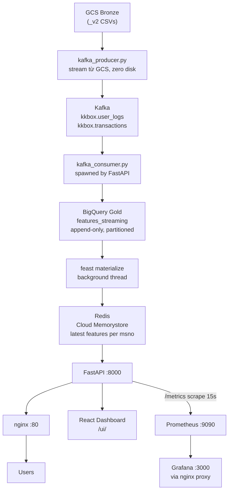

# KKBox Churn Prediction

End-to-end MLOps pipeline dự đoán churn của người dùng KKBox music streaming, triển khai trên GCP.

Chiến lược **historical playback**: dữ liệu năm 2017 (Bronze `_v2` files) được replay qua Kafka để giả lập môi trường streaming thực tế, phục vụ online prediction và monitoring liên tục.

## System Architecture



## Data Strategy

| Layer | Nội dung | Trạng thái |
|-------|----------|-----------|
| Bronze | Raw CSV từ Kaggle (toàn bộ thời gian) | Đã load lên GCS |
| Silver | Cleaned & deduplicated Parquet (Spark) | Đã xử lý |
| Gold / features_train | Feature snapshot đến 2016-12-31, dùng cho training | Đã dùng |
| Gold / features_streaming | Streaming updates từ 2017, append-only | Ghi bởi kafka_consumer.py |

## Modules

| Module | Mô tả |
|--------|-------|
| `data_pipeline/` | Kafka producer/consumer (streaming), Spark Bronze→Silver→Gold (batch) |
| `model_pipeline/` | XGBoost training, MLflow tracking, upload artifacts lên GCS |
| `feature_store/` | Feast definitions (entity, feature views, feature_store.yaml) |
| `serving_pipeline/` | FastAPI prediction API, drift detection, React dashboard |
| `monitoring_pipeline/` | Prometheus, Grafana, nginx proxy |

## Model Results

| Metric | Value |
|--------|-------|
| AUC-ROC | **0.8924** |
| AUC-PR | 0.5044 |
| F1 | 0.5068 |
| Precision | 0.3593 |
| Recall | **0.8596** |
| Optimal threshold | 0.789 |

Split strategy: **out-of-time** theo `registration_init_time < 2016-06-01`.
Train: ~804k rows — Test: ~157k rows — Churn rate: ~10%.

## Deployment (Production)

| Thành phần | Chi tiết |
|-----------|---------|
| VM | `kkbox-serving` — GCE e2-standard-2, asia-southeast1-b |
| Static IP | `35.198.232.66` |
| Dashboard | http://35.198.232.66/ui/ |
| FastAPI | nginx :80 → uvicorn :8000 |
| systemd | Service `kkbox-serving`, auto-restart on crash/reboot |
| Kafka | Docker, ports 9092 (internal) / 9093 (host) |
| Redis | Cloud Memorystore `10.80.68.19:6379` |
| Monitoring | Docker (monitoring_pipeline/), xem qua Cloud Shell SSH tunnel port 3000 |

```bash
# Logs FastAPI
sudo journalctl -u kkbox-serving -f

# Restart FastAPI
sudo systemctl restart kkbox-serving

# Start infrastructure (Kafka, Redis, Feast, MLflow)
docker compose up -d kafka redis feast mlflow

# Start monitoring stack
cd monitoring_pipeline && docker compose up -d
```

## Quick Start (local dev)

```bash
git clone <repo-url>
cd kkbox-churn-prediction

cp .env.example .env
# Điền GCP credentials vào .env

# Start Kafka, Redis, Feast, MLflow
docker compose up -d kafka redis feast mlflow

# Apply Feast definitions
feast -c feature_store apply

# Train model (cần GCP credentials)
python model_pipeline/training/train.py

# Start API server
cd serving_pipeline
export FEAST_REPO_PATH=../feature_store
uvicorn app.main:app --reload --port 8000
```

Dashboard: http://localhost:8000/ui/
API docs: http://localhost:8000/docs

## GCP Resources

| Resource | Value |
|----------|-------|
| Project ID | `kkbox-churn-prediction-493716` |
| GCS Bucket | `gs://kkbox-churn-prediction-493716-data/` |
| Model artifacts | `gs://kkbox-churn-prediction-493716-data/models/kkbox-churn-xgboost/` |
| BQ training table | `kkbox-churn-prediction-493716.kkbox_gold.features_train` |
| BQ streaming table | `kkbox-churn-prediction-493716.kkbox_gold.features_streaming` |
| BQ members table | `kkbox-churn-prediction-493716.kkbox_gold.members` |
| Redis | `10.80.68.19:6379` (Cloud Memorystore) |

## Repository Layout

```
kkbox-churn-prediction/
├── docker-compose.yml              # Kafka, Redis, Feast, MLflow
├── feature_store/
│   ├── feature_store.yaml
│   ├── entities.py
│   └── feature_views.py
├── data_pipeline/
│   ├── ingestion/
│   │   ├── kafka_producer.py       # GCS → Kafka (zero disk)
│   │   └── kafka_consumer.py       # Kafka → BigQuery + Feast Redis
│   └── processing/
│       ├── bronze_to_silver.py     # Spark: clean, cast, deduplicate
│       └── silver_to_gold.py       # Spark: feature aggregation, join
├── model_pipeline/
│   └── training/
│       ├── train.py
│       └── update_preprocessing_config.py
├── serving_pipeline/
│   ├── app/
│   │   ├── main.py
│   │   ├── predict.py
│   │   ├── explain.py
│   │   ├── stream.py               # Streaming simulation control
│   │   ├── drift.py                # PSI + KS drift detection
│   │   ├── feature_cache.py
│   │   ├── metrics.py
│   │   ├── schemas.py
│   │   └── stats_store.py
│   ├── service/
│   │   └── prediction.py
│   └── static/                     # React dashboard (CDN + Babel)
│       ├── index.html
│       ├── pages.jsx
│       └── charts.jsx
└── monitoring_pipeline/
    ├── docker-compose.yml          # Prometheus + Grafana + nginx proxy
    ├── prometheus.yml
    ├── nginx.conf
    └── grafana/
        └── provisioning/
```

## Environment Variables

| Variable | Default | Mô tả |
|----------|---------|-------|
| `GCP_PROJECT_ID` | `kkbox-churn-prediction-493716` | GCP project |
| `GCS_BUCKET` | `kkbox-churn-prediction-493716-data` | GCS bucket chứa model |
| `FEAST_REPO_PATH` | `../feature_store` | Đường dẫn tới Feast repo |
| `KAFKA_BOOTSTRAP_SERVERS` | `localhost:9093` | Kafka broker |
| `CHURN_THRESHOLD` | `0.781` | Ngưỡng quyết định churn |
