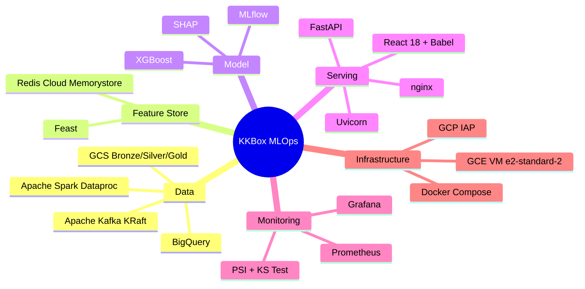
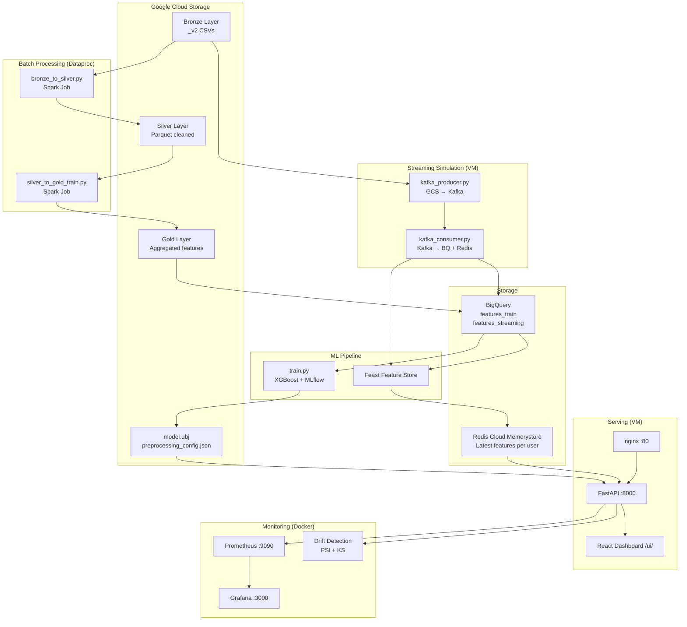

# KKBox Churn Prediction

> End-to-end MLOps pipeline dự đoán churn người dùng KKBox music streaming — từ raw data đến real-time serving, giám sát và drift detection trên GCP.

---

## Mục lục

- [Giới thiệu bài toán](#giới-thiệu-bài-toán)
- [Đề xuất mô hình](#đề-xuất-mô-hình)
- [Tech Stack](#tech-stack)
- [Kiến trúc hệ thống](#kiến-trúc-hệ-thống)
- [Repository Structure](#repository-structure)
- [Hướng dẫn triển khai](#hướng-dẫn-triển-khai)
- [Kết quả](#kết-quả)
- [Thành viên nhóm](#thành-viên-nhóm)
- [Giảng viên hướng dẫn](#giảng-viên-hướng-dẫn)

---

## Giới thiệu bài toán

**Churn** (rời bỏ dịch vụ) là một trong những vấn đề kinh doanh cốt lõi của các nền tảng subscription. KKBox — nền tảng âm nhạc streaming lớn tại Đài Loan và Đông Nam Á — phải đối mặt với bài toán: **dự đoán user nào sẽ không gia hạn gói trong tháng tới**, từ đó có chiến lược giữ chân kịp thời.

### Định nghĩa

Cho một tập user $U$ với lịch sử hành vi đến thời điểm $t$, mục tiêu là học một hàm:

$$f: \mathbf{x}_i \rightarrow y_i \in \{0, 1\}$$

Trong đó:
- $\mathbf{x}_i \in \mathbb{R}^{18}$ là vector feature của user $i$ (hành vi nghe nhạc, lịch sử subscription, thông tin nhân khẩu)
- $y_i = 1$ nếu user churn (không gia hạn), $y_i = 0$ nếu tiếp tục dùng

### Đặc điểm dữ liệu

| Đặc điểm | Chi tiết |
|---------|---------|
| Số users | ~1.08M |
| Churn rate | ~10% (imbalanced) |
| Thời gian | Lịch sử đến 2016-12-31, streaming simulation 2017 |
| Features | 18 features từ 3 nguồn: subscription, listening behavior, demographics |

### Thách thức

- **Class imbalance**: chỉ ~10% user churn → mô hình dễ thiên về predict non-churn
- **Cold start**: user mới chưa có lịch sử → cần imputation bằng population median
- **Feature drift**: hành vi user thay đổi theo thời gian → cần monitoring liên tục
- **Real-time serving**: features phải được cập nhật liên tục từ streaming data

---

## Đề xuất mô hình

### Tại sao XGBoost?

Bài toán churn prediction trên tabular data với 18 features — XGBoost là lựa chọn phù hợp vì:

1. **Xử lý tốt imbalanced data** qua `scale_pos_weight` — tự động cân bằng class weight
2. **Không cần feature scaling** — tree-based model bất biến với magnitude của feature
3. **Tốc độ inference nhanh** — phù hợp online serving (<10ms/request)
4. **SHAP compatible** — TreeExplainer cho explanation chính xác và nhanh, giải thích được tại sao user được dự đoán churn
5. **Hiệu quả trên tabular data** — thường outperform deep learning với dữ liệu có cấu trúc

### Hyperparameters

```python
{
    "n_estimators": 500,
    "max_depth": 6,
    "learning_rate": 0.05,
    "subsample": 0.8,
    "colsample_bytree": 0.8,
    "min_child_weight": 10,
    "eval_metric": "auc",
    "early_stopping_rounds": 30,
}
```

### Split Strategy

**Out-of-time split** theo `registration_init_time`:

```
Toàn bộ dataset (~1.08M users)
        │
        ├── Train: registration < 2016-06-01  (~804k users, 74%)
        └── Test:  registration ≥ 2016-06-01  (~157k users, 14%)
```

Out-of-time split phản ánh thực tế production: model được train trên user đăng ký sớm hơn, test trên user mới — tránh data leakage theo thời gian.

### Features (18 features)

| Nhóm | Features | Ý nghĩa |
|------|---------|---------|
| **Demographics** | `city`, `bd`, `gender`, `registered_via` | Thông tin cơ bản user |
| **Subscription** | `total_transactions`, `total_amount_paid`, `avg_amount_paid`, `auto_renew_count`, `cancel_count` | Hành vi thanh toán |
| **Listening** | `total_log_days`, `total_secs`, `avg_daily_secs` | Mức độ hoạt động |
| **Engagement** | `total_num_25`, `total_num_50`, `total_num_75`, `total_num_985`, `total_num_100`, `total_num_unq` | Độ sâu tương tác với nội dung |

### Threshold Optimization

Thay vì dùng threshold mặc định 0.5, tìm threshold tối ưu hóa F1-score trên test set:

$$\hat{y}_i = \begin{cases} 1 & \text{nếu } P(\text{churn} | \mathbf{x}_i) \geq \tau^* \\ 0 & \text{ngược lại} \end{cases}$$

Với $\tau^* = 0.789$ (F1-maximized), serving dùng $\tau = 0.781$. Mô hình ưu tiên **Recall cao** — trong bài toán churn, bỏ sót user sắp rời đi (False Negative) tốn kém hơn nhiều so với cảnh báo nhầm (False Positive).

### Kết quả

| Metric | Value |
|--------|-------|
| AUC-ROC | **0.8924** |
| AUC-PR | 0.5044 |
| F1 Score | 0.5068 |
| Precision | 0.3593 |
| Recall | **0.8596** |
| Optimal Threshold | 0.789 |

---

## Tech Stack



| Layer | Technology |
|-------|-----------|
| Data Storage | Google Cloud Storage, BigQuery |
| Stream Processing | Apache Kafka 7.5 (KRaft mode), Python |
| Batch Processing | Apache Spark 3.x trên GCP Dataproc |
| Feature Store | Feast, Redis (Cloud Memorystore) |
| Model Training | XGBoost, scikit-learn, MLflow |
| Explainability | SHAP TreeExplainer |
| API Serving | FastAPI, Uvicorn, nginx |
| Frontend | React 18 + Babel (no build step) |
| Monitoring | Prometheus, Grafana |
| Drift Detection | PSI (Population Stability Index), KS Test |
| Infrastructure | GCE VM, Docker Compose |

---

## Kiến trúc hệ thống



---

## Repository Structure

```
kkbox-churn-prediction/
│
├── docker-compose.yml              # Kafka, Redis, Feast, MLflow
├── Makefile                        # Build automation
├── pyproject.toml                  # Python dependencies
├── .env.example                    # Environment template
│
├── feature_store/                  # Feast definitions
│   ├── feature_store.yaml          # GCP provider, BigQuery offline, Redis online
│   ├── entities.py                 # Entity: msno (user ID)
│   └── feature_views.py            # FeatureView: 18 features, TTL 30 ngày
│
├── data_pipeline/
│   ├── ingestion/
│   │   ├── kafka_producer.py       # GCS _v2 CSVs → Kafka (zero disk, gcsfs)
│   │   └── kafka_consumer.py       # Kafka → cumulative features → BigQuery + Redis
│   └── processing/
│       ├── bronze_to_silver.py     # Spark: clean, cast, deduplicate
│       └── silver_to_gold.py       # Spark: feature aggregation, join
│
├── model_pipeline/
│   └── training/
│       ├── train.py                # XGBoost training, MLflow tracking, GCS upload
│       └── update_preprocessing_config.py
│
├── serving_pipeline/
│   ├── app/
│   │   ├── main.py                 # FastAPI entry, CORS, Prometheus middleware
│   │   ├── predict.py              # POST /predict/, /predict/batch
│   │   ├── explain.py              # SHAP explanation router
│   │   ├── stream.py               # Streaming simulation control
│   │   ├── drift.py                # PSI + KS drift detection
│   │   ├── metrics.py              # Prometheus metric definitions
│   │   ├── schemas.py              # Pydantic schemas
│   │   ├── feature_cache.py        # In-memory msno → last date
│   │   └── stats_store.py          # Prediction statistics
│   ├── service/
│   │   └── prediction.py           # PredictionService: Feast → XGBoost → SHAP
│   ├── static/                     # React dashboard (CDN + Babel, no build)
│   │   ├── index.html
│   │   ├── pages.jsx               # 6 trang dashboard
│   │   └── charts.jsx
│   └── Dockerfile
│
└── monitoring_pipeline/
    ├── docker-compose.yml          # Prometheus + Grafana + nginx proxy
    ├── prometheus.yml              # Scrape config
    ├── nginx.conf                  # Reverse proxy, strip Origin header
    └── grafana/
        └── provisioning/           # Auto-provision datasource + dashboards
```

---

## Hướng dẫn triển khai

### Yêu cầu

- GCP Project với billing enabled
- `gcloud` CLI đã cài và đã `gcloud auth login`
- Python 3.11+
- Docker + Docker Compose
- Tài khoản có quyền: BigQuery Admin, Storage Admin, Dataproc Admin, Redis Admin, Compute Admin

### Bước 1 — Clone repo và cấu hình môi trường

```bash
git clone https://github.com/<your-org>/kkbox-churn-prediction.git
cd kkbox-churn-prediction

cp .env.example .env
# Chỉnh sửa .env với thông tin GCP của bạn:
# GCP_PROJECT_ID=your-project-id
# GCS_BUCKET=your-bucket-name
# BQ_DATASET=kkbox_gold
```

Cài dependencies:

```bash
python3 -m venv .venv
source .venv/bin/activate
pip install -e ".[dev]"
```

### Bước 2 — Chuẩn bị GCP Resources

**Tạo GCS bucket:**
```bash
gcloud storage buckets create gs://<YOUR_BUCKET> \
  --location=asia-southeast1
```

**Upload raw data lên Bronze layer:**
```bash
# Download Kaggle dataset: https://www.kaggle.com/competitions/kkbox-churn-prediction-challenge
# Sau đó upload lên GCS
gcloud storage cp *.csv gs://<YOUR_BUCKET>/bronze/raw/
```

**Tạo Cloud Memorystore (Redis):**
```bash
gcloud redis instances create kkbox-redis \
  --size=1 \
  --region=asia-southeast1 \
  --tier=basic \
  --redis-version=redis_7_2
```

Lấy Redis IP:
```bash
gcloud redis instances describe kkbox-redis \
  --region=asia-southeast1 \
  --format="get(host)"
```

Cập nhật `feature_store/feature_store.yaml` với Redis IP vừa lấy được:
```yaml
online_store:
  type: redis
  connection_string: "<REDIS_IP>:6379"
```

### Bước 3 — Batch Processing (Spark trên Dataproc)

**Tạo Dataproc cluster:**
```bash
gcloud dataproc clusters create kkbox-spark-cluster \
  --region=asia-southeast1 \
  --zone=asia-southeast1-b \
  --master-machine-type=n1-standard-4 \
  --worker-machine-type=n1-standard-4 \
  --num-workers=2 \
  --image-version=2.1-debian11
```

**Upload scripts lên GCS:**
```bash
gcloud storage cp data_pipeline/processing/bronze_to_silver.py \
  gs://<YOUR_BUCKET>/scripts/

gcloud storage cp data_pipeline/processing/silver_to_gold.py \
  gs://<YOUR_BUCKET>/scripts/silver_to_gold_train.py
```

**Chạy Bronze → Silver:**
```bash
gcloud dataproc jobs submit pyspark \
  gs://<YOUR_BUCKET>/scripts/bronze_to_silver.py \
  --cluster=kkbox-spark-cluster \
  --region=asia-southeast1
```

**Chạy Silver → Gold (tạo features_train):**
```bash
gcloud dataproc jobs submit pyspark \
  gs://<YOUR_BUCKET>/scripts/silver_to_gold_train.py \
  --cluster=kkbox-spark-cluster \
  --region=asia-southeast1
```

**Xóa cluster sau khi xong để tiết kiệm chi phí:**
```bash
gcloud dataproc clusters delete kkbox-spark-cluster \
  --region=asia-southeast1 --quiet
```

**Load Gold data vào BigQuery:**
```bash
bq load \
  --source_format=PARQUET \
  --replace \
  kkbox_gold.features_train \
  "gs://<YOUR_BUCKET>/gold/features_train/*.parquet"
```

### Bước 4 — Model Training

Cài application default credentials:
```bash
gcloud auth application-default login
```

Chạy training:
```bash
python model_pipeline/training/train.py
```

Script sẽ tự động:
- Đọc `features_train` từ BigQuery
- Train XGBoost với MLflow tracking
- Upload `model.ubj`, `preprocessing_config.json`, `feature_cols.json` lên GCS

### Bước 5 — Khởi tạo Feature Store

```bash
cd feature_store
feast apply
```

Materialize features_train vào Redis (lần đầu tiên):
```bash
feast materialize-incremental $(date -u +%Y-%m-%dT%H:%M:%S)
```

### Bước 6 — Triển khai Serving trên VM

**Tạo GCE VM:**
```bash
gcloud compute instances create kkbox-serving \
  --zone=asia-southeast1-b \
  --machine-type=e2-standard-2 \
  --image-family=debian-11 \
  --image-project=debian-cloud \
  --boot-disk-size=50GB \
  --tags=http-server,https-server
```

**SSH vào VM:**
```bash
gcloud compute ssh kkbox-serving \
  --zone=asia-southeast1-b \
  --tunnel-through-iap
```

**Cài Docker trên VM:**
```bash
curl -fsSL https://get.docker.com | sh
sudo usermod -aG docker $USER
newgrp docker
```

**Clone repo và start services:**
```bash
git clone https://github.com/<your-org>/kkbox-churn-prediction.git
cd kkbox-churn-prediction

# Cài GCP credentials
gcloud auth application-default login

cp .env.example .env
# Chỉnh sửa .env

# Start Kafka, Redis local, Feast, MLflow
docker compose up -d

# Tạo Docker network dùng chung
docker network create churn-network 2>/dev/null || true

# Start FastAPI
docker compose --profile docker-only up -d --build api_serving
```

**Verify API đang chạy:**
```bash
curl http://localhost:8000/health
# {"status":"healthy"}
```

### Bước 7 — Monitoring (Prometheus + Grafana)

```bash
cd monitoring_pipeline
docker compose up -d
```

Truy cập Grafana qua SSH tunnel từ máy local:
```bash
gcloud compute ssh kkbox-serving \
  --zone=asia-southeast1-b \
  --tunnel-through-iap \
  --ssh-flag="-4 -L 3000:localhost:3000"
```

Mở browser: **http://localhost:3000** (admin / admin)

### Bước 8 — Chạy Streaming Simulation

Truy cập React Dashboard:
```bash
gcloud compute ssh kkbox-serving \
  --zone=asia-southeast1-b \
  --tunnel-through-iap \
  --ssh-flag="-4 -L 8000:localhost:8000"
```

Mở browser: **http://localhost:8000/ui/**

Vào tab **Streaming Simulation** → Click **Start** để bắt đầu replay dữ liệu 2017 qua Kafka.

Sau mỗi ngày streaming:
- Features được cập nhật vào BigQuery `features_streaming` và Redis
- Drift check tự động chạy sau 90 giây
- Kết quả hiển thị ở tab **Drift Detection** và Grafana

### API Endpoints

| Method | Endpoint | Mô tả |
|--------|---------|-------|
| GET | `/health` | Health check |
| POST | `/predict/` | Dự đoán churn cho 1 user |
| POST | `/predict/batch` | Dự đoán batch nhiều users |
| GET | `/explain/{msno}` | SHAP explanation top-3 reasons |
| GET | `/drift` | PSI summary tất cả ngày |
| GET | `/drift/{date}` | PSI + KS chi tiết theo ngày |
| POST | `/stream/start` | Bắt đầu streaming simulation |
| POST | `/stream/stop` | Dừng streaming |
| GET | `/stats` | Thống kê prediction |
| GET | `/metrics` | Prometheus metrics |
| GET | `/sample` | Lấy msno mẫu từ Redis |

---

## Triển khai Local (Không cần VM/Dataproc/Memorystore)

Phương án này chạy toàn bộ compute trên máy local, chỉ dùng GCP làm storage (BigQuery + GCS — chi phí gần như bằng 0 với data < 10GB). Thích hợp cho mục đích học tập, demo, hoặc khi không muốn tốn chi phí VM.

**So sánh với triển khai Cloud:**

| Component | Cloud | Local |
|-----------|-------|-------|
| Batch Processing | Dataproc (Spark cluster) | PySpark local mode |
| Redis | Cloud Memorystore | Docker container |
| Serving | GCE VM | `uvicorn` local |
| Monitoring | Docker trên VM | Docker local |
| BigQuery | ✅ Giữ nguyên | ✅ Giữ nguyên |
| GCS | ✅ Giữ nguyên | ✅ Giữ nguyên |

### Yêu cầu

- Python 3.11+
- Docker + Docker Compose
- Java 11+ (cho PySpark local)
- GCP account (chỉ cần BigQuery + GCS, miễn phí với data < 10GB)
- `gcloud auth application-default login` đã chạy

### Bước 1 — Clone repo và cài dependencies

```bash
git clone https://github.com/<your-org>/kkbox-churn-prediction.git
cd kkbox-churn-prediction

cp .env.example .env
# Chỉnh sửa .env:
# GCP_PROJECT_ID=your-project-id
# GCS_BUCKET=your-bucket-name

python3 -m venv .venv
source .venv/bin/activate
pip install -e ".[dev]"

gcloud auth application-default login
```

### Bước 2 — Start Kafka + Redis local bằng Docker Compose

```bash
docker compose up -d kafka redis mlflow
```

Kiểm tra:
```bash
docker ps | grep -E "kafka|redis|mlflow"
```

### Bước 3 — Cấu hình Feature Store dùng Redis local

Chỉnh `feature_store/feature_store.yaml`:

```yaml
online_store:
  type: redis
  connection_string: "localhost:6379"
```

### Bước 4 — Batch Processing bằng PySpark local

Thay vì submit lên Dataproc, chạy trực tiếp với PySpark local mode. Cài PySpark:

```bash
pip install pyspark==3.5.0
```

Chỉnh `BUCKET` trong script để trỏ vào local path hoặc GCS, rồi chạy:

```bash
# Bronze → Silver
python data_pipeline/processing/bronze_to_silver.py

# Silver → Gold (features_train)
python data_pipeline/processing/silver_to_gold.py
```

> **Lưu ý:** PySpark local mode dùng toàn bộ CPU trên máy. Với ~1M rows, mỗi job mất 5-15 phút tuỳ cấu hình máy.

Load kết quả vào BigQuery:

```bash
bq load \
  --source_format=PARQUET \
  --replace \
  kkbox_gold.features_train \
  "gs://<YOUR_BUCKET>/gold/features_train/*.parquet"
```

### Bước 5 — Training model

```bash
python model_pipeline/training/train.py
```

### Bước 6 — Khởi tạo Feature Store

```bash
cd feature_store
feast apply
feast materialize-incremental $(date -u +%Y-%m-%dT%H:%M:%S)
```

### Bước 7 — Chạy FastAPI local

```bash
cd ..
uvicorn serving_pipeline.app.main:app \
  --host 0.0.0.0 --port 8000 --reload
```

Truy cập dashboard: **http://localhost:8000/ui/**

API docs: **http://localhost:8000/docs**

### Bước 8 — Monitoring local

```bash
# Tạo Docker network nếu chưa có
docker network create churn-network 2>/dev/null || true

cd monitoring_pipeline
docker compose up -d
```

Truy cập Grafana: **http://localhost:3000** (admin / admin)

### Bước 9 — Chạy Streaming Simulation

Vào **http://localhost:8000/ui/** → tab **Streaming Simulation** → Click **Start**.

Consumer sẽ đọc từ Kafka, tính cumulative features, ghi vào BigQuery `features_streaming` và update Redis local. Drift check tự động chạy sau 90 giây mỗi ngày.

---

### Xóa tài nguyên GCP sau khi hoàn thành

```bash
# Xóa Redis
gcloud redis instances delete kkbox-redis \
  --region=asia-southeast1 --quiet

# Xóa VM
gcloud compute instances delete kkbox-serving \
  --zone=asia-southeast1-b --quiet

# Xóa GCS bucket
gcloud storage rm --recursive gs://<YOUR_BUCKET>/

# Xóa BigQuery dataset
bq rm -r -f -d <PROJECT_ID>:kkbox_gold
```

---

## Thành viên nhóm

| Họ và tên | MSSV |
|-----------|------|
| Phạm Trung Hiếu|23020070 |
| Trương Văn Hải|23020058 |
| Phạm Nam Khánh|23020088 |
| Vương Nguyệt Bình| 22028329|
| Nguyễn Trường Nam| 23021644|

---

## Giảng viên hướng dẫn

| Vai trò | Họ và tên |
|---------|-----------|
| Supervisor |PGS. TS Nguyễn Ngọc Hóa |
| Supervisor |CN. Nguyễn Thanh Sơn |
