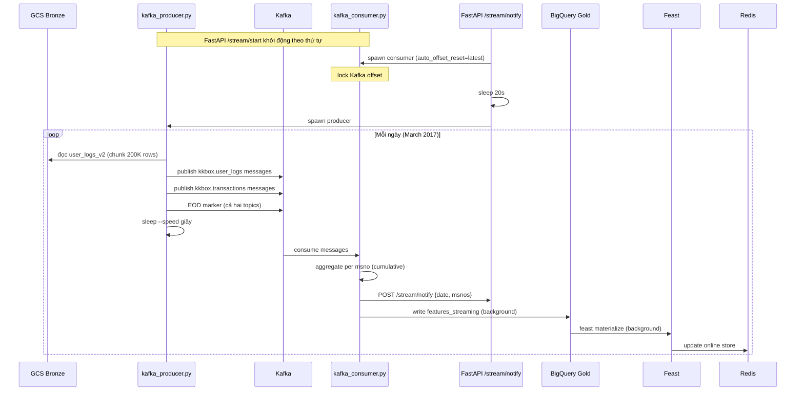
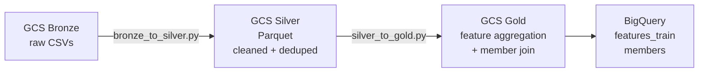

# Data Pipeline

Xử lý dữ liệu KKBox gồm hai phần: **Kafka historical playback** để giả lập streaming thực tế, và **Spark batch jobs** để transform Bronze → Silver → Gold (chạy một lần khi khởi tạo dữ liệu).

## File Structure

```
data_pipeline/
├── ingestion/
│   ├── kafka_producer.py    -- Replay _v2 CSVs từ GCS → Kafka (zero disk)
│   └── kafka_consumer.py    -- Kafka → BigQuery Gold → Feast Redis
└── processing/
    ├── bronze_to_silver.py  -- Spark: clean, cast, deduplicate
    └── silver_to_gold.py    -- Spark: feature aggregation, join với members
```

## Streaming Flow



## Bronze Data Files (GCS)

| File | Kích thước | Dùng cho |
|------|-----------|----------|
| `user_logs.csv` | 28.4 GB | Training snapshot (pre-2017) |
| `user_logs_v2.csv` | 1.3 GB | Streaming replay (2017) |
| `transactions.csv` | 1.6 GB | Training snapshot (pre-2017) |
| `transactions_v2.csv` | 110 MB | Streaming replay (2017) |

Bucket: `gs://kkbox-churn-prediction-493716-data/bronze/raw/`

## Kafka Topics

| Topic | Source | Message key |
|-------|--------|-------------|
| `kkbox.user_logs` | `user_logs_v2.csv` | `msno` |
| `kkbox.transactions` | `transactions_v2.csv` | `msno` |

Kafka chạy ở chế độ KRaft (không cần ZooKeeper). Hai listeners:
- `PLAINTEXT://kafka:9092` — internal Docker network (container-to-container)
- `PLAINTEXT_HOST://localhost:9093` — host access (producer/consumer Python scripts)

Sau khi gửi hết dữ liệu một ngày, producer gửi **EOD marker** trên cả hai topics. Consumer chờ EOD từ cả hai mới flush ngày đó.

## kafka_producer.py

Stream trực tiếp từ GCS bằng `gcsfs` — không ghi xuống disk.

- Pre-load `transactions_v2.csv` vào memory (~25 MB) tại startup
- Stream `user_logs_v2.csv` theo từng chunk 200K rows
- Với mỗi ngày: gửi hết messages → gửi EOD marker → sleep `--speed` giây

```bash
# Dry run — test đọc GCS, không cần Kafka
python data_pipeline/ingestion/kafka_producer.py --dry-run

# Replay 55 giây/ngày
python data_pipeline/ingestion/kafka_producer.py --speed 55

python data_pipeline/ingestion/kafka_producer.py --help
```

## kafka_consumer.py

Thường được FastAPI spawn tự động qua `POST /stream/start`.

**Cumulative aggregation:**

```
features_final = baseline (features_train tính đến 2016-12-31)
               + delta (tích lũy trong memory từ 2017-03-01 đến ngày hiện tại)
```

Mỗi ngày mới, delta cộng dồn → feature vector luôn là cumulative từ đầu đến ngày đó.

**Aggregation per msno:**

| Nguồn | Features |
|-------|---------|
| user_logs | `total_log_days`, `total_secs`, `avg_daily_secs`, `num_25/50/75/985/100/unq` |
| transactions | `total_transactions`, `total_amount_paid`, `avg_amount_paid`, `auto_renew_count`, `cancel_count` |
| members | `city`, `bd`, `gender`, `registered_via` (static, loaded at startup) |

```bash
# Dry run — không ghi BQ/Redis
python data_pipeline/ingestion/kafka_consumer.py --dry-run

# Full run
export FEAST_REPO_PATH=./feature_store
python data_pipeline/ingestion/kafka_consumer.py \
  --bootstrap-servers localhost:9093 \
  --notify-url http://localhost:8000/stream/notify
```

## BigQuery Tables

| Table | Nội dung | Ghi bởi |
|-------|----------|---------|
| `kkbox_gold.features_train` | Training snapshot (cutoff 2016-12-31), ~1.08M rows | Spark silver_to_gold |
| `kkbox_gold.features_streaming` | Streaming updates 2017, append-only | kafka_consumer.py |
| `kkbox_gold.members` | Member profiles: city, bd, gender, registered_via | Spark silver_to_gold |

## Spark Jobs (one-time, Dataproc)



```bash
make spark-bronze-silver   # Bronze → Silver
make spark-silver-gold     # Silver → Gold + BigQuery load
```

## Environment Variables

| Variable | Default | Mô tả |
|----------|---------|-------|
| `KAFKA_BOOTSTRAP_SERVERS` | `localhost:9093` | Kafka broker (host port) |
| `GCP_PROJECT_ID` | `kkbox-churn-prediction-493716` | GCP project |
| `FEAST_REPO_PATH` | `./feature_store` | Đường dẫn tới `feature_store/` |

## Dependencies

| Package | Mục đích |
|---------|---------|
| `gcsfs` | Đọc GCS trực tiếp, zero disk |
| `confluent-kafka` | Kafka producer/consumer |
| `google-cloud-bigquery` | Ghi vào BigQuery |
| `feast` | Materialize features vào Redis |
| `pyspark` | Spark batch jobs |

## Lưu ý

- Consumer mất ~2 phút tải member profiles từ BQ lúc startup. FastAPI delay 20 giây trước khi spawn producer để consumer kịp lock Kafka offset, nhưng producer vẫn gửi ngày 1–3 vào backlog trước khi consumer sẵn sàng xử lý.
- Kafka log retention: 1 giờ hoặc 2 GB/topic, tránh đầy disk sau nhiều lần replay.
- Kafka port **9093** dùng từ host; **9092** dùng trong Docker network.
