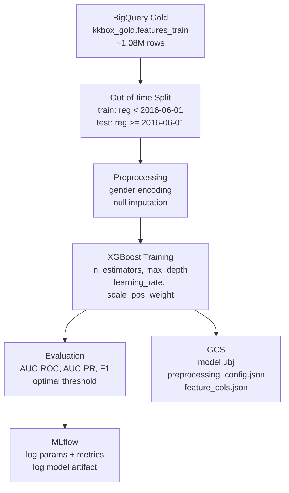

# Model Pipeline

Training pipeline cho XGBoost churn prediction model: đọc features từ BigQuery Gold, train với out-of-time validation, track experiments qua MLflow, và upload model artifacts lên GCS.

## File Structure

```
model_pipeline/
└── training/
    ├── train.py                        -- Main training script
    └── update_preprocessing_config.py  -- Regenerate preprocessing_config.json từ BQ

feature_store/                          -- Dùng chung cho training và serving
├── feature_store.yaml
├── entities.py
└── feature_views.py
```

## Training Pipeline



## Data & Split Strategy

**Source:** `kkbox-churn-prediction-493716.kkbox_gold.features_train`
- ~1,082,190 rows, feature snapshot tính đến 2016-12-31
- Target: `is_churn`, churn rate ~10%

| Split | Điều kiện | Rows |
|-------|-----------|------|
| Train | `registration_init_time < 2016-06-01` | ~804k |
| Test | `registration_init_time >= 2016-06-01` | ~157k |

Out-of-time split phản ánh thực tế: model train trên user đăng ký trước, test trên user mới hơn.

## Features (18 features)

| Feature | Nguồn | Mô tả |
|---------|-------|-------|
| `city` | members | Thành phố đăng ký |
| `bd` | members | Tuổi người dùng |
| `gender` | members | Giới tính (encoded) |
| `registered_via` | members | Kênh đăng ký |
| `total_transactions` | transactions | Tổng số giao dịch |
| `total_amount_paid` | transactions | Tổng tiền đã thanh toán |
| `avg_amount_paid` | transactions | Trung bình mỗi giao dịch |
| `auto_renew_count` | transactions | Số lần tự động gia hạn |
| `cancel_count` | transactions | Số lần hủy gói |
| `total_log_days` | user_logs | Số ngày có hoạt động |
| `total_secs` | user_logs | Tổng giây nghe nhạc |
| `avg_daily_secs` | user_logs | Trung bình giây/ngày |
| `total_num_25` | user_logs | Bài nghe được 25% |
| `total_num_50` | user_logs | Bài nghe được 50% |
| `total_num_75` | user_logs | Bài nghe được 75% |
| `total_num_985` | user_logs | Bài nghe được 98.5% |
| `total_num_100` | user_logs | Bài nghe hoàn toàn |
| `total_num_unq` | user_logs | Số bài hát unique |

## Model Results

| Metric | Value |
|--------|-------|
| AUC-ROC | **0.8924** |
| AUC-PR | 0.5044 |
| F1 | 0.5068 |
| Precision | 0.3593 |
| Recall | **0.8596** |
| Optimal threshold (F1-maximized) | **0.789** |

Threshold mặc định trong serving là `0.781` (override qua env var `CHURN_THRESHOLD`).

## Run Training

```bash
# Mặc định: đọc BQ, log MLflow, upload GCS
python model_pipeline/training/train.py

# Tùy chỉnh hyperparameters
python model_pipeline/training/train.py \
  --n-estimators 1000 \
  --max-depth 5 \
  --learning-rate 0.03

python model_pipeline/training/train.py --help
```

Cần GCP credentials hợp lệ (`GOOGLE_APPLICATION_CREDENTIALS` hoặc ADC).

## GCS Model Artifacts

```
gs://kkbox-churn-prediction-493716-data/models/kkbox-churn-xgboost/
├── model.ubj                   -- XGBoost model (binary)
├── preprocessing_config.json   -- Medians/modes cho cold-start imputation
└── feature_cols.json           -- Ordered list của 18 feature columns
```

`preprocessing_config.json` chứa:
- `num_cols_medians`: median của từng numeric feature (dùng khi user không có data)
- `bd_median`, `city_mode`, `registered_via_mode`: giá trị mặc định cho member features
- `gender_map`: mapping string → int cho gender

**Cold-start imputation:** user chưa có features trong Redis được fill bằng population median từ config này — model thấy "average user" thay vì user hoàn toàn inactive.

```bash
# Regenerate preprocessing_config.json mà không retrain
python model_pipeline/training/update_preprocessing_config.py
```

## Feast Feature Store

```bash
# Apply definitions (tạo/update schema)
feast -c feature_store apply

# Kiểm tra
feast -c feature_store entities list
feast -c feature_store feature-views list

# Materialize thủ công (thường consumer làm tự động)
feast -c feature_store materialize-incremental $(date -u +%Y-%m-%dT%H:%M:%S)
```

Trong production, materialize chạy tự động sau mỗi ngày streaming trong background thread của kafka_consumer.py.

## MLflow Tracking

MLflow server chạy trong Docker (xem `docker-compose.yml` root):
- Backend: SQLite (`mlflow.db`)
- Artifact store: `./artifacts`
- Port: 5000

```bash
# Xem MLflow UI
open http://localhost:5000
```

## Environment Variables

| Variable | Default | Mô tả |
|----------|---------|-------|
| `GCP_PROJECT_ID` | `kkbox-churn-prediction-493716` | GCP project |
| `BQ_FEATURES_TABLE` | `kkbox-churn-prediction-493716.kkbox_gold.features_train` | BigQuery source |
| `GCS_MODEL_BUCKET` | `kkbox-churn-prediction-493716-data` | Bucket upload model |
| `GCS_MODEL_PREFIX` | `models/kkbox-churn-xgboost` | Prefix trong bucket |
| `MLFLOW_TRACKING_URI` | `mlruns` | MLflow backend URI |
| `MLFLOW_EXPERIMENT_NAME` | `kkbox-churn-xgboost` | Tên experiment |

## Dependencies

| Package | Mục đích |
|---------|---------|
| `xgboost` | Model training |
| `google-cloud-bigquery` | Đọc training data |
| `google-cloud-storage` | Upload model artifacts |
| `mlflow` | Experiment tracking |
| `scikit-learn` | Preprocessing, metrics |
| `feast` | Feature store definitions |
| `shap` | SHAP explainability |
