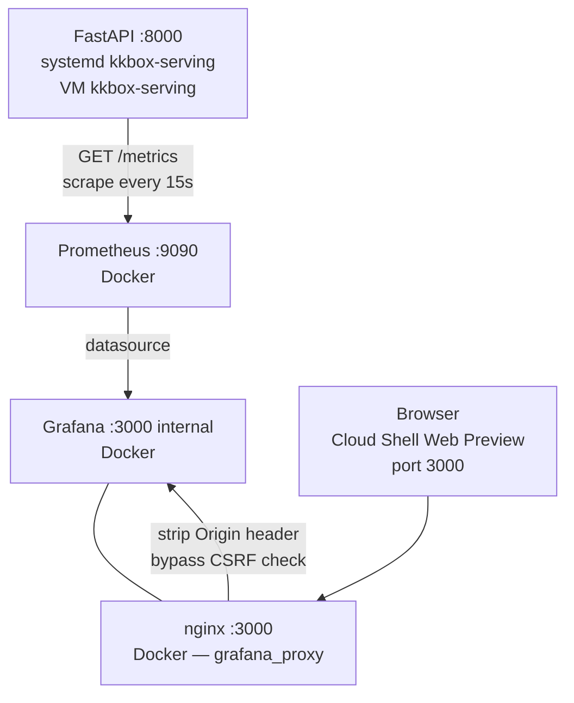

# Monitoring Pipeline

Prometheus + Grafana cho infrastructure và prediction metrics. Dashboard nghiệp vụ là React UI tích hợp trong FastAPI serving app.

## Architecture



nginx proxy phía trước Grafana cần thiết vì Grafana 10+ từ chối Origin header từ Cloud Shell Web Preview. Nginx strip header `Origin` trước khi forward vào Grafana.

## File Structure

```
monitoring_pipeline/
├── docker-compose.yml          -- Prometheus + Grafana + nginx proxy
├── prometheus.yml              -- Scrape config
├── nginx.conf                  -- Reverse proxy, strip Origin header
└── grafana/
    ├── provisioning/
    │   ├── datasources/
    │   │   └── prometheus.yml  -- Auto-provision Prometheus datasource
    │   └── dashboards/
    │       └── default.yml     -- Dashboard folder config
    └── dashboards/             -- Dashboard JSON files
```

## Quick Start

```bash
cd monitoring_pipeline
docker compose up -d
```

| Service | Port | Credentials |
|---------|------|-------------|
| Prometheus | 9090 | — |
| Grafana | 3000 (qua nginx proxy) | admin / admin |

FastAPI chạy như systemd service trên cùng VM (không trong Docker). Xem `serving_pipeline/README.md`.

## Truy cập Grafana từ Cloud Shell

```bash
# Bước 1 — Mở tunnel từ Cloud Shell (để terminal chạy ngầm)
gcloud compute ssh kkbox-serving \
  --zone=asia-southeast1-b \
  --tunnel-through-iap \
  -- -L 0.0.0.0:3000:localhost:3000 -N

# Bước 2 — Web Preview → Preview on port 3000
```

## Prometheus

### Scrape Target

`prometheus.yml` scrapes `http://host.docker.internal:8000/metrics` mỗi 15 giây.

Kiểm tra: mở http://localhost:9090/targets → `kkbox_serving_api` phải show **UP**.

### Available Metrics

| Metric | Type | Labels | Mô tả |
|--------|------|--------|-------|
| `serving_http_requests_total` | Counter | method, path, status_code | Tổng HTTP requests |
| `serving_http_request_duration_seconds` | Histogram | method, path | Request latency |
| `serving_http_requests_in_progress` | Gauge | method, path | In-flight requests |
| `serving_prediction_requests_total` | Counter | endpoint, kind | Prediction calls |
| `serving_prediction_results_total` | Counter | endpoint, is_churn | Churn vs retain |
| `serving_prediction_churn_probability` | Histogram | endpoint | Score distribution |
| `serving_batch_prediction_size` | Histogram | — | Records per batch |
| `serving_feast_online_fetch_total` | Counter | status | Feast Redis lookups |
| `serving_feast_online_fetch_duration_seconds` | Histogram | status | Feast latency |
| `kkbox_feature_psi` | Gauge | feature, date | PSI per feature per day |
| `kkbox_feature_ks_stat` | Gauge | feature, date | KS statistic per feature |

## Grafana Dashboards

Prometheus datasource được auto-provision khi Grafana khởi động (qua `grafana/provisioning/datasources/prometheus.yml`). Không cần setup thủ công.

### Dashboard 1 — API Health

**Request Rate (RPS)**
```promql
rate(serving_http_requests_total[1m])
```

**P99 Latency**
```promql
histogram_quantile(0.99, rate(serving_http_request_duration_seconds_bucket[5m]))
```

**Error Rate**
```promql
rate(serving_http_requests_total{status_code=~"5.."}[1m])
/ rate(serving_http_requests_total[1m])
```

**In-Flight Requests**
```promql
serving_http_requests_in_progress
```

### Dashboard 2 — Churn Prediction

**Churn Rate (rolling 5m)**
```promql
rate(serving_prediction_results_total{is_churn="True"}[5m])
/ rate(serving_prediction_results_total[5m])
```

**Prediction Throughput**
```promql
rate(serving_prediction_requests_total[1m])
```

**Churn Probability Distribution** *(heatmap)*
```promql
rate(serving_prediction_churn_probability_bucket[5m])
```

**Feast Fetch Success Rate**
```promql
rate(serving_feast_online_fetch_total{status="success"}[5m])
/ rate(serving_feast_online_fetch_total[5m])
```

**Feast P95 Latency**
```promql
histogram_quantile(0.95, rate(serving_feast_online_fetch_duration_seconds_bucket[5m]))
```

### Lưu dashboard JSON

Sau khi chỉnh sửa dashboard trong Grafana UI:
1. Dashboard settings → JSON Model → Copy
2. Lưu vào `monitoring_pipeline/grafana/dashboards/<name>.json`
3. Grafana tự load từ thư mục đó khi restart

## Business Dashboard

React dashboard tại http://35.198.232.66/ui/ thay thế Streamlit, được serve trực tiếp bởi FastAPI — không cần deploy riêng.

| Page | Mô tả |
|------|-------|
| Single User | Predict churn + SHAP explanation cho một msno |
| Batch Prediction | List msno → bảng kết quả |
| Statistics | Cumulative prediction counts, churn rate |
| Streaming Simulation | Replay March 2017, date chips, user list |
| Drift Detection | PSI + KS per feature per day |
| Model Info | Metrics, feature importance |
| API Health | Service status, endpoint latency |
