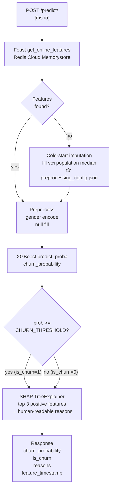
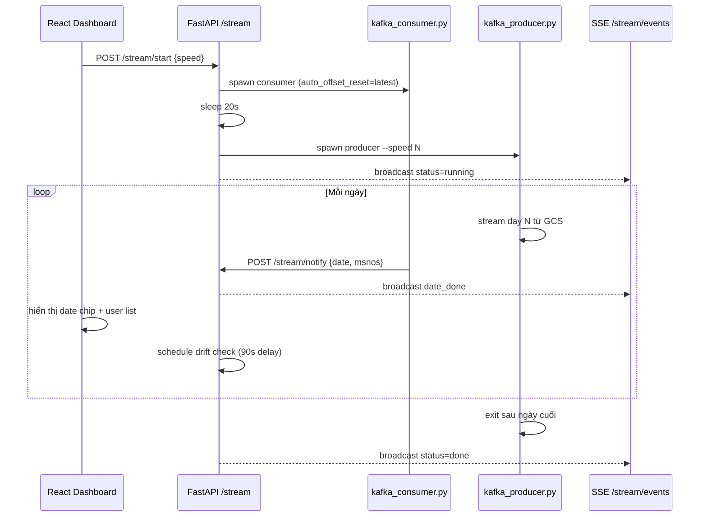
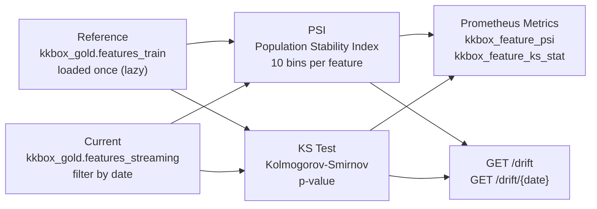

# Serving Pipeline

FastAPI REST API cho online và batch churn prediction, kết hợp React dashboard phục vụ streaming simulation, SHAP explainability, và drift detection.

Live: **http://35.198.232.66/ui/**

## File Structure

```
serving_pipeline/
├── app/
│   ├── main.py            -- FastAPI app, CORS, Prometheus middleware, static mount
│   ├── predict.py         -- POST /predict/, /predict/batch
│   ├── explain.py         -- POST /explain/
│   ├── stream.py          -- POST /stream/start|pause|resume|stop
│   ├── drift.py           -- PSI + KS drift detection, GET /drift
│   ├── feature_cache.py   -- In-memory msno → last streaming date
│   ├── metrics.py         -- Prometheus metric definitions
│   ├── schemas.py         -- Pydantic request/response schemas
│   └── stats_store.py     -- In-memory prediction statistics
├── service/
│   └── prediction.py      -- PredictionService: Feast → preprocess → XGBoost → SHAP
├── static/
│   ├── index.html         -- React 18 + Babel standalone (no build step)
│   ├── pages.jsx          -- 6 trang dashboard
│   └── charts.jsx         -- Chart components
├── Dockerfile
└── requirements.txt
```

## Prediction Flow



## Streaming Simulation



Pause/Resume dùng `SIGSTOP`/`SIGCONT` trên producer process. Consumer tiếp tục chạy.

## Drift Detection

Sau mỗi ngày streaming, FastAPI schedule drift check chạy sau 90 giây (đợi BQ write + Feast materialize hoàn thành).



**PSI thresholds:**

| PSI | Status |
|-----|--------|
| < 0.10 | stable |
| 0.10 – 0.25 | warning |
| ≥ 0.25 | critical |

## API Endpoints

### Prediction

| Method | Path | Mô tả |
|--------|------|-------|
| POST | `/predict/` | Single user: churn probability + SHAP reasons |
| POST | `/predict/batch` | Batch: list msno → churn scores (no SHAP) |
| POST | `/explain/` | SHAP explanation |
| GET | `/sample` | Random msno từ Redis (demo) |

**Request:**
```json
{ "msno": "<base64-encoded user id>" }
```

**Response:**
```json
{
  "msno": "...",
  "churn_probability": 0.84,
  "is_churn": 1,
  "member_found": true,
  "reasons": ["Đã hủy gói nhiều lần", "Ít bài nghe hoàn toàn"],
  "feature_timestamp": "2017-03-05"
}
```

### Streaming Simulation

| Method | Path | Mô tả |
|--------|------|-------|
| POST | `/stream/start` | Spawn producer + consumer |
| POST | `/stream/pause` | SIGSTOP producer |
| POST | `/stream/resume` | SIGCONT producer |
| POST | `/stream/stop` | SIGTERM cả hai, reset state |
| GET | `/stream/status` | status, current_date, dates_done |
| GET | `/stream/users` | Danh sách msno theo ngày (paginated) |
| GET | `/stream/events` | SSE: `status` và `date_done` events |

### Drift Detection

| Method | Path | Mô tả |
|--------|------|-------|
| GET | `/drift` | PSI summary tất cả các ngày đã chạy |
| GET | `/drift/{date}` | PSI + KS chi tiết per feature cho một ngày |

### Infrastructure

| Method | Path | Mô tả |
|--------|------|-------|
| GET | `/health` | `{"status": "healthy"}` |
| GET | `/metrics` | Prometheus scrape endpoint |
| GET | `/stats` | Cumulative prediction statistics |
| GET | `/stats/churned` | Danh sách users dự đoán churn |

## React Dashboard (6 pages)

| Page | Mô tả |
|------|-------|
| Single User | Nhập msno → churn probability, SHAP reasons, feature timestamp |
| Batch Prediction | Nhập list msno → bảng kết quả |
| Statistics | Tổng predictions, churn rate, danh sách churned users |
| Streaming Simulation | Start/pause/resume/stop, progress bar, date chips, paginated user list |
| Model Info | AUC-ROC, threshold, feature list, split strategy |
| API Health | Status services, endpoint latency |

Tất cả 6 pages mount đồng thời (`display: none/block`) để preserve state (đặc biệt SSE connection trên tab Simulation) khi switch tab.

## Prometheus Metrics

| Metric | Type | Labels |
|--------|------|--------|
| `serving_http_requests_total` | Counter | method, path, status_code |
| `serving_http_request_duration_seconds` | Histogram | method, path |
| `serving_http_requests_in_progress` | Gauge | method, path |
| `serving_prediction_requests_total` | Counter | endpoint, kind |
| `serving_prediction_results_total` | Counter | endpoint, is_churn |
| `serving_prediction_churn_probability` | Histogram | endpoint |
| `serving_batch_prediction_size` | Histogram | — |
| `serving_feast_online_fetch_total` | Counter | status |
| `serving_feast_online_fetch_duration_seconds` | Histogram | status |
| `kkbox_feature_psi` | Gauge | feature, date |
| `kkbox_feature_ks_stat` | Gauge | feature, date |

## Deployment (Production)

```bash
# Xem logs
sudo journalctl -u kkbox-serving -f

# Restart
sudo systemctl restart kkbox-serving

# Status
sudo systemctl status kkbox-serving
```

App chạy trên GCE VM `kkbox-serving` (asia-southeast1-b, static IP `35.198.232.66`):
- nginx :80 → uvicorn :8000
- systemd service `kkbox-serving`: auto-restart on crash/reboot

## Run (local dev)

```bash
cd serving_pipeline
pip install -r requirements.txt

export FEAST_REPO_PATH=../feature_store
uvicorn app.main:app --reload --port 8000
```

Dashboard: http://localhost:8000/ui/
Docs: http://localhost:8000/docs

## Environment Variables

| Variable | Default | Mô tả |
|----------|---------|-------|
| `GCS_BUCKET` | `kkbox-churn-prediction-493716-data` | GCS bucket chứa model |
| `GCS_MODEL_PREFIX` | `models/kkbox-churn-xgboost` | Prefix model artifacts |
| `GCP_PROJECT_ID` | `kkbox-churn-prediction-493716` | GCP project |
| `CHURN_THRESHOLD` | `0.781` | Ngưỡng phân loại churn |
| `FEAST_REPO_PATH` | `/app/feature_store` | Đường dẫn Feast repo |

## Dependencies

| Package | Mục đích |
|---------|---------|
| `fastapi` | Web framework |
| `uvicorn` | ASGI server |
| `xgboost` | Model inference |
| `feast` | Online feature lookup từ Redis |
| `shap` | SHAP TreeExplainer |
| `prometheus-client` | Metrics exposition |
| `redis` | Direct Redis access (cho /sample) |
| `google-cloud-storage` | Load model artifacts từ GCS |
| `google-cloud-bigquery` | Drift detection queries |
